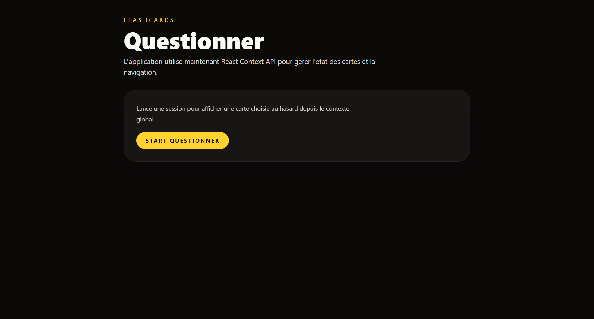
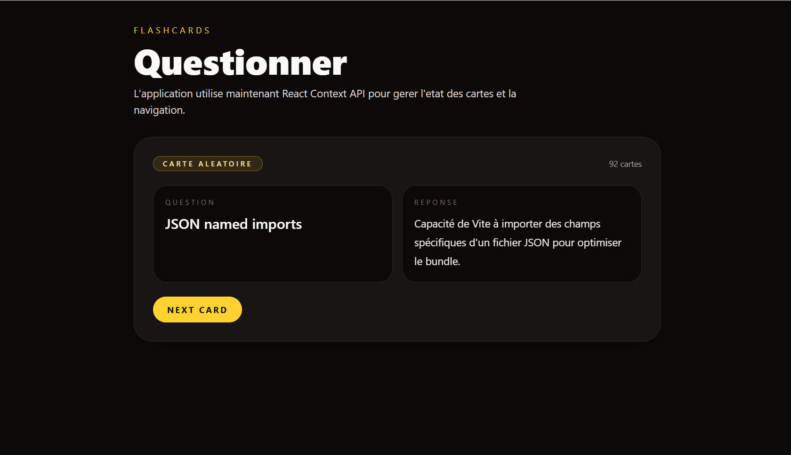

# Questionner




Questionner is a simple flashcards app built with React and Vite.

## Description

This project shows random question/answer cards from a local dataset.
It is intentionally small, fast, and easy to maintain.

## Key Features

- Start a flashcards session from an empty state
- Show a random card
- Move to the next random card
- Manage state with React Context API
- Keep flashcards in a single data source
- Run tests with Vitest
- Deploy as a single-page app on Firebase Hosting

## Tech Stack

- React 19
- Vite 7
- Tailwind CSS 4
- Vitest
- JSDoc
- Firebase Hosting

## Dependencies

Main:

- `react`
- `react-dom`
- `tailwindcss`

Development:

- `vite`
- `@vitejs/plugin-react`
- `@tailwindcss/vite`
- `vitest`
- `jsdoc`

## Installation

```bash
git clone <your-repo-url>
cd questionner
npm install
```

## Usage

Start local development:

```bash
npm run dev
```

Default local URL:

```txt
http://127.0.0.1:5174
```

Build for production:

```bash
npm run build
```

Preview production build:

```bash
npm run preview
```

## Project Structure

```txt
questionner/
├─ src/
│  ├─ app/                        # App composition and providers
│  ├─ components/layout/          # Layout components
│  ├─ features/flashcards/
│  │  ├─ components/              # Feature UI components
│  │  ├─ context/                 # Context provider
│  │  ├─ data/                    # Flashcards dataset
│  │  ├─ hooks/                   # Feature hooks
│  │  └─ utils/                   # Utilities
│  ├─ pages/                      # Page-level components
│  ├─ styles/                     # Global styles
│  └─ main.jsx                    # App entry point
├─ tests/                         # Test suite
├─ firebase.json                  # Firebase Hosting config
├─ .env.example                   # Environment template
├─ vite.config.js                 # Vite config
└─ package.json                   # Scripts and dependencies
```

## Available Scripts

With npm:

- `npm run dev` - start dev server
- `npm run build` - build production bundle
- `npm run preview` - preview production build
- `npm run test` - run tests once
- `npm run test:watch` - run tests in watch mode
- `npm run doc` - generate docs from JSDoc comments

With yarn:

- `yarn dev`
- `yarn build`
- `yarn preview`
- `yarn test`
- `yarn test:watch`
- `yarn doc`

## Environment Variables

Copy template:

```bash
cp .env.example .env
```

Defined variables:

```env
VITE_FIREBASE_API_KEY=
VITE_FIREBASE_AUTH_DOMAIN=
VITE_FIREBASE_PROJECT_ID=
VITE_FIREBASE_STORAGE_BUCKET=
VITE_FIREBASE_MESSAGING_SENDER_ID=
VITE_FIREBASE_APP_ID=
```

These are prepared for Firebase integration.

## Testing

Run tests:

```bash
npm run test
```

Watch mode:

```bash
npm run test:watch
```

Current tests cover:

- utility behavior
- provider behavior and edge cases
- session and empty-state interactions
- dataset integrity checks

## Build and Deployment

Build output:

```bash
npm run build
```

Generated folder:

```txt
dist/
```

Deploy to Firebase Hosting:

```bash
npm run build
firebase deploy
```

`firebase.json` is configured for SPA routing (`** -> /index.html`).

## Contributing

Contributions are welcome.

- Fork the repository
- Create a feature branch
  ```bash
  git checkout -b feat/your-feature
  ```
- Commit your changes
- Run tests and build locally
  ```bash
  npm run test
  npm run build
  ```
- Open a pull request

## License

No license file is currently included.
If you plan to publish this project, add a `LICENSE` file (for example, MIT).

## Author

Maintainer: Iuliia
Repository owner: `izahnd`

